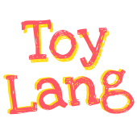

<p align="center">



<p align="center">A toy programming language built with TypeScript for learning purposes.<p>

<p>

## Learning resources

Here are few excellent resources I followed while building ToyLang.

- "Building a parser from scratch" course by Dmitry Soshnikov
  http://dmitrysoshnikov.com/courses/parser-from-scratch/

- "A handbook for making programming languages."
  https://craftinginterpreters.com

- "Let’s Build A Simple Interpreter" blogposts
  https://ruslanspivak.com/lsbasi-part1/

## Examples

The syntax & semantics of the language is very similar to JavaScript with few differences.

To run examples from [/examples](./examples) folder, you simply need to run:

```sh
# yarn example <name_of_example>
yarn example factorial
```

## Scope of the project

The scope of the project is only limited to educational purposes, the code itself is written for better understanding, rather than efficient or production use cases.

### Todos

- [ ] Write more tests.
- [ ] Refactor [ASTFactories.ts](src\ASTFactories.ts).
- [ ] Refactor typings.
- [ ] Add data structures (Arrays, Objects).
- [ ] Add more examples.
- [ ] Add support for imported modules.
- [ ] Add support for Class declarations in interpreter.
- [ ] More standard library functions.
- [ ] Better error handling.
- [ ] Overall refactor of the codebase.
